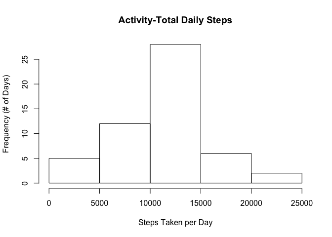
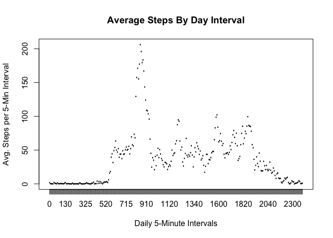
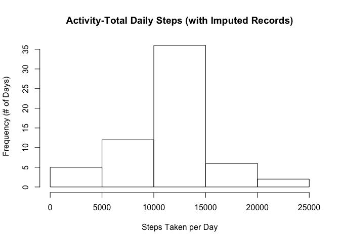
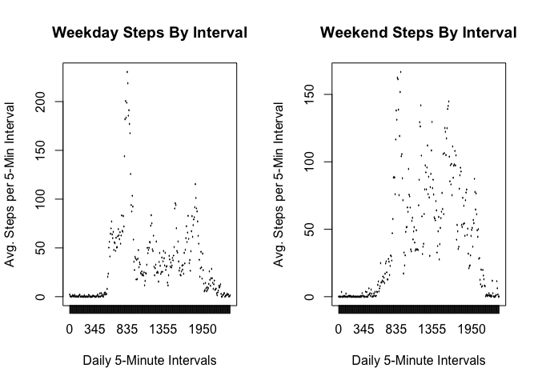

Reproducible Research: Assignment 1
===================================

Activity Monitoring Data
------------------------

The variables included in this dataset are:

**steps:** Number of steps taking in a 5-minute interval (missing values
are coded as NA)  
**date:** The date on which the measurement was taken in YYYY-MM-DD
format  
**interval:** Identifier for the 5-minute interval in which measurement
was taken

The dataset is stored in a comma-separated-value (CSV) file and there
are a total of 17,568 observations in this dataset.

1. Data Import & Cleaning
-------------------------

    ## Install packages and libraries
    ## Download the activity.csv file and read to dataframe; initially omit NAs
    ## Convert 'date' column to date class; interval to factor

    ## install.packages("data.table")
    ## library(data.table)

    filename <- "activity.csv"

    if (!file.exists(filename)){
          fileURL <- "https://d396qusza40orc.cloudfront.net/repdata%2Fdata%2Factivity.zip"
          download.file(fileURL, filename, method="curl")
    }  

    activity_all <- read.csv(filename, stringsAsFactors = FALSE, na.strings = "NA")
    activity <- na.omit(activity_all)

    activity$date <- as.Date(activity$date, "%m/%d/%y")
    activity$interval <- factor(activity$interval)

    options(scipen=999)

2. Total Steps Taken Each Day (Histogram)
-----------------------------------------

    ## Summarize the total steps taken each day
    ## Create a histogram (frequency) of daily step count

    activity_sum <- aggregate(steps ~ date, data = activity, sum)
    hist(activity_sum$steps,
         main = "Activity-Total Daily Steps",
         xlab = "Steps Taken per Day", ylab = "Frequency (# of Days)")

3. Mean/Median Steps Taken Each Day
-----------------------------------

NOTE: Technically, it's the mean/median of the daily step totals

    ## Compute mean and median for the activity_sum (by day created in question #2)

    activity_mean <- round(mean(activity_sum$steps), digits = 2)
    activity_median <- median(activity_sum$steps)

The mean number of steps taken per day (across the sample number of
days) is 10766.19. And, the median number of steps taken per day is
10765.

4. Time Series of Average Steps Taken
-------------------------------------

NOTE: Question is unclear, but given data set interpreted as a plot of
the average (mean) steps per interval (across days), plotted by interval

    ## Find the average steps per interval across days
    ## Plot a line chart with intervals on x-axis

    interval_avg <- aggregate(steps ~ interval, data = activity, mean)

    plot(interval_avg$interval, interval_avg$steps, type = "l",
         xlab = "Daily 5-Minute Intervals", ylab = "Avg. Steps per 5-Min Interval",
         main = "Average Steps By Day Interval")

5. 5-Minute Interval with Greatest Average Steps
------------------------------------------------

    ## Find the interval with the largest average number of steps
    ## and present the interval number (factor) and steps amount

    interval_sort <- interval_avg[order(interval_avg$steps), ]
    interval_max <- interval_sort$interval[nrow(interval_sort)]
    interval_max_amt <- round(interval_sort$steps[nrow(interval_sort)], digits = 2)

The 5-minutes interval with the greatest average steps is 835, which, on
average, has 206.17 steps.

6. Imputing Data for Missing Data
---------------------------------

Replace NA rows with average steps for the particular interval

    ## Put missing rows in a separate dataframe
    ## Impute the missing steps value based on interval from interval_avg
    ## Insert the lookup value (via merge) and clean up table
    ## Show abbreviated head & tail of imputed table

    missing <- subset(activity_all, is.na(steps))
    imputed <- merge(missing, interval_avg, by="interval")
    imputed <- imputed[, -2]
    colnames(imputed)[3] <- "steps"

    print(head(imputed, 6))

    ##   interval     date    steps
    ## 1        0  10/1/12 1.716981
    ## 2        0 11/30/12 1.716981
    ## 3        0  11/4/12 1.716981
    ## 4        0  11/9/12 1.716981
    ## 5        0 11/14/12 1.716981
    ## 6        0 11/10/12 1.716981

    print(tail(imputed, 6))

    ##      interval     date    steps
    ## 2299     2355  11/1/12 1.075472
    ## 2300     2355  10/8/12 1.075472
    ## 2301     2355  11/4/12 1.075472
    ## 2302     2355  11/9/12 1.075472
    ## 2303     2355  10/1/12 1.075472
    ## 2304     2355 11/30/12 1.075472

7. Total Steps Taken Each Day (Histogram) with Imputed Data
-----------------------------------------------------------

    ## Bind the activity df (that excluded NAs) + the NA records (with imputed)
    ## First make sure class types and column positions match
    ## Recreate the histogram

    imputed$date <- as.Date(imputed$date, "%m/%d/%y")
    imputed$interval <- factor(imputed$interval)
    imputed$steps <- as.integer(imputed$steps)

    activity_temp <- activity[, c(2,3,1)]
    imputed_temp <- imputed[, c(2,1,3)]

    act_imp <- rbind(activity_temp, imputed_temp)

    act_imp_sum <- aggregate(steps ~ date, data = act_imp, sum)
    hist(act_imp_sum$steps,
         main = "Activity-Total Daily Steps (with Imputed Records)",
         xlab = "Steps Taken per Day", ylab = "Frequency (# of Days)")

8. Panel Plot Comparing Interval Steps - Weekdays vs. Weekends
--------------------------------------------------------------

    ## Subset the activity data (with imputed) for weekdays and weekends
    ## Searching for the first letter being an "S" is a short-cut
    ## For each subset find the mean number of steps by interval
    ## Merge the interval analyses to simplify plotting

    act_wday <- subset(act_imp, substring(weekdays(act_imp$date), 1, 1) != "S") 
    act_wend <- subset(act_imp, substring(weekdays(act_imp$date), 1, 1) == "S")

    wday_interval_avg <- aggregate(steps ~ interval, data = act_wday, mean)
    wend_interval_avg <- aggregate(steps ~ interval, data = act_wend, mean)

    wday_wend_avg <- merge(wday_interval_avg, wend_interval_avg, by = "interval")
    colnames(wday_wend_avg)[2] <- "weekday_steps"
    colnames(wday_wend_avg)[3] <- "weekend_steps"

    par(mfrow = c(1, 2))

    plot(wday_wend_avg$interval, wday_wend_avg$weekday_steps, type = "l",
         xlab = "Daily 5-Minute Intervals", ylab = "Avg. Steps per 5-Min Interval",
         main = "Weekday Steps By Interval")

    plot(wday_wend_avg$interval, wday_wend_avg$weekend_steps, type = "l",
         xlab = "Daily 5-Minute Intervals", ylab = "Avg. Steps per 5-Min Interval",
         main = "Weekend Steps By Interval")

